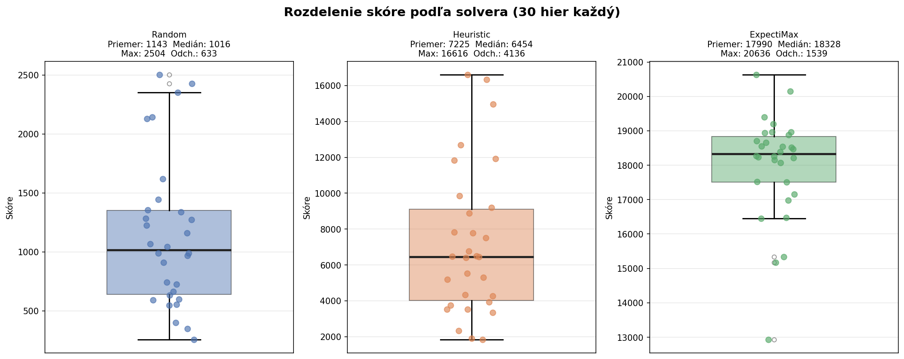
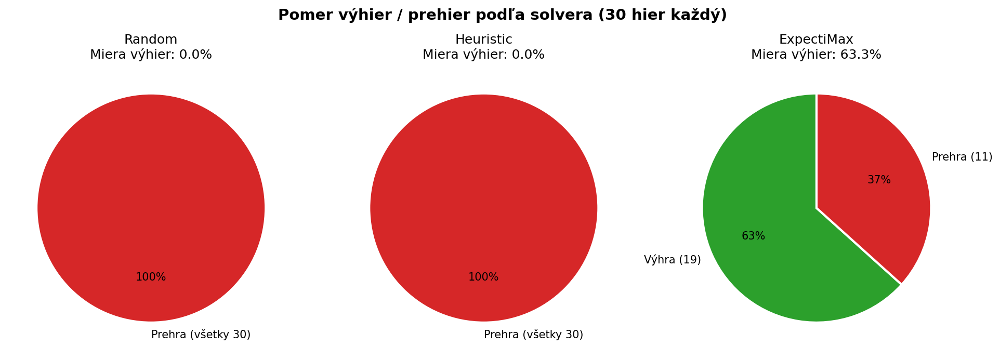
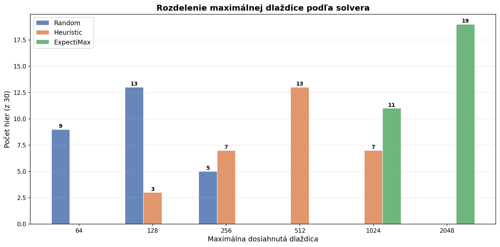
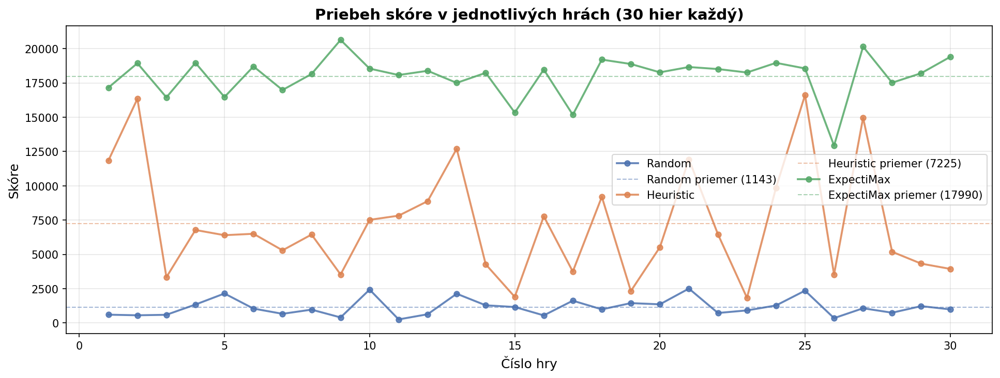
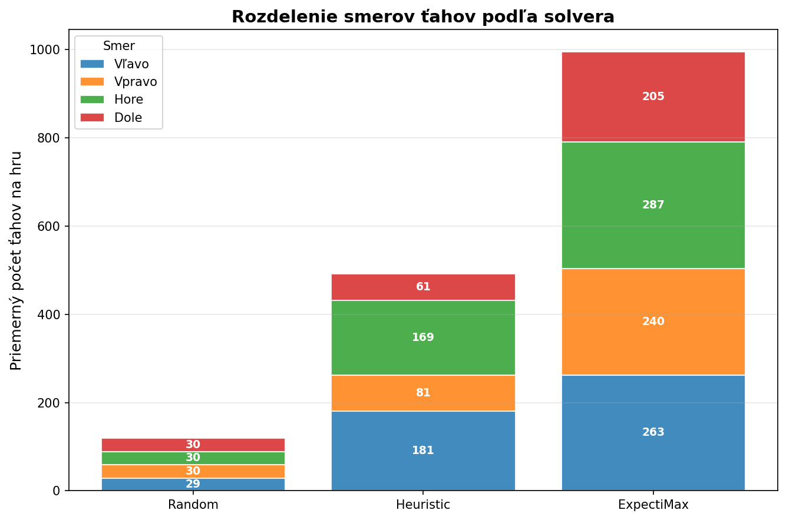
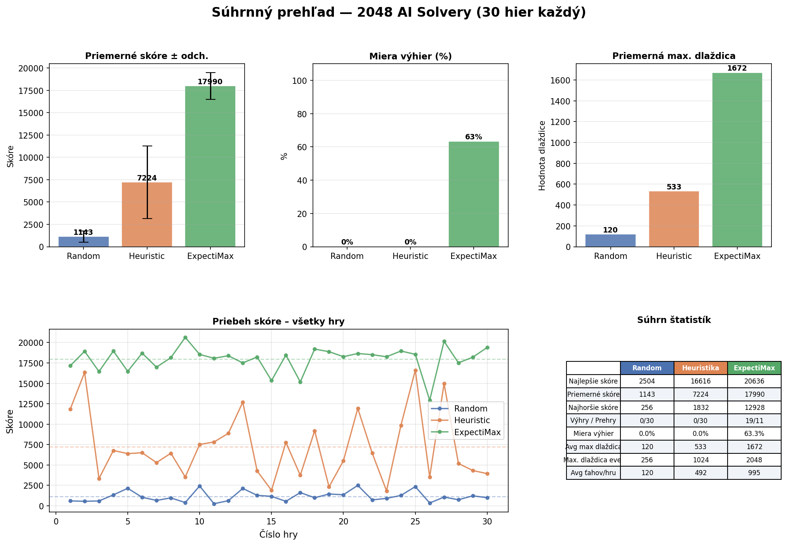
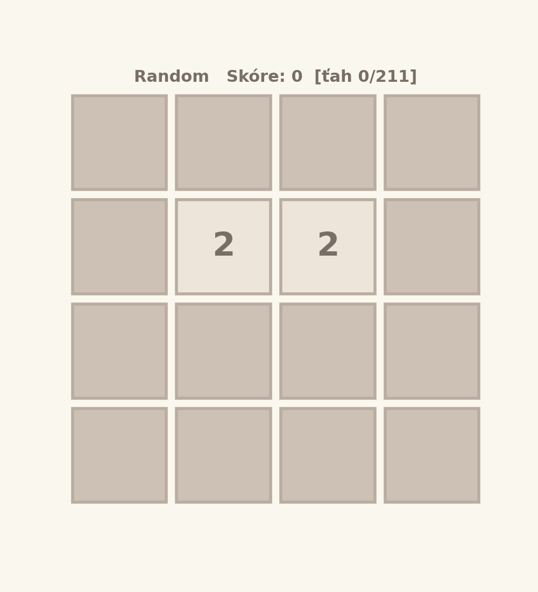

# Implementácia a optimalizácia AI solverov pre hru 2048

---

| | |
|---|---|
| **Predmet** | Základy umelej inteligencie (ZUI) |
| **Autor** | Tomáš Mucha |
| **Rok** | 2026 |
| **Prostredie** | Python 3.9 · NumPy · Jupyter Notebook |
| **Repozitár** | https://github.com/Kames003/ZUI |
| **Prezentácia** | https://kames003.github.io/ZUI/ |

---

## Abstrakt

Táto práca sa zaoberá implementáciou, analýzou a iteratívnou optimalizáciou troch AI solverov pre stochastickú doskú hru 2048. Implementovaný bol náhodný baseline solver, deterministický greedy heuristický solver a pokročilý ExpectiMax solver s adaptívnou hĺbkou prehľadávania. Solvery boli otestované v sérii piatich experimentálnych behov (celkovo 150 hier) s dôrazom na reprodukovateľnosť a férové porovnanie. ExpectiMax dosiahol 63 % mieru výhier (19/30 hier) s priemerným skóre 17 990, čo predstavuje 15,7-násobné zlepšenie oproti náhodnej baseline. Práca dokumentuje celý iteratívny vývojový cyklus vrátane identifikácie a opravy kritickej metodologickej chyby (kontaminácia náhodného seedu) a systematického tuningu 8 konfigurácií eval funkcie. Na záver je diskutovaná hranica manuálneho tunovania a perspektíva Machine Learning prístupov.

### Kľúčové výsledky

| Solver | Avg skóre | Win rate | Max tile |
|---|---|---|---|
| Random | 1 143 | 0 % | 256 |
| Greedy Heuristic | 7 225 | 0 % | 1 024 |
| **ExpectiMax** | **17 990** | **63 %** | **2 048** |

---

## Obsah

1. [Úvod a motivácia](#1-úvod-a-motivácia)
2. [Teoretické základy](#2-teoretické-základy)
3. [Implementácia hry 2048](#3-implementácia-hry-2048)
4. [Implementácia solverov](#4-implementácia-solverov)
5. [Metodológia experimentov](#5-metodológia-experimentov)
6. [Výsledky a analýza](#6-výsledky-a-analýza)
7. [Iteratívna optimalizácia](#7-iteratívna-optimalizácia)
8. [Záver a diskusia](#8-záver-a-diskusia)
9. [AI Readiness — Perspektíva strojového učenia](#9-ai-readiness)
10. [Použitie generatívnej AI](#10-použitie-generatívnej-ai)
11. [Prílohy](#11-prílohy)

---

## 1. Úvod a motivácia

### 1.1 O hre 2048

2048 je jednohráčová číselná desková hra na mriežke 4×4. Hráč posúva všetky dlaždice v jednom zo štyroch smerov. Dlaždice s rovnakou hodnotou sa pri kolízii spájajú a zdvojnásobujú. Po každom platnom ťahu sa na náhodné prázdne políčko objaví nová dlaždica — hodnota 2 s pravdepodobnosťou 90 %, alebo hodnota 4 s pravdepodobnosťou 10 %. Cieľom je dosiahnuť dlaždicu hodnoty 2 048.

```
Príklad stavu plochy:          Po ťahu "left":
┌──────┬──────┬──────┬──────┐  ┌──────┬──────┬──────┬──────┐
│   2  │   4  │   2  │   4  │  │   2  │   4  │   2  │   4  │
├──────┼──────┼──────┼──────┤  ├──────┼──────┼──────┼──────┤
│  16  │  16  │   8  │   8  │  │  32  │  16  │   0  │   0  │
├──────┼──────┼──────┼──────┤  ├──────┼──────┼──────┼──────┤
│   4  │   0  │   4  │   0  │  │   8  │   0  │   0  │   0  │
├──────┼──────┼──────┼──────┤  ├──────┼──────┼──────┼──────┤
│ 512  │ 256  │   0  │   0  │  │ 512  │ 256  │   0  │   0  │
└──────┴──────┴──────┴──────┘  └──────┴──────┴──────┴──────┘
                                 skóre += 32 + 16 + 8 = 56
```

### 1.2 Prečo je 2048 zaujímavý problém pre AI?

| Vlastnosť | Popis | Dôsledok pre AI |
|-----------|-------|-----------------|
| **Stochastickosť** | Náhodné spawnovanie dlaždíc | Nemožno použiť čistý deterministický prístup |
| **Veľký stavový priestor** | Teoreticky ~10⁴⁰³ možných stavov | Úplné prohľadávanie je nereálne |
| **Horizont odmeňovania** | Okamžitý zisk môže byť dlhodobo nevýhodný | Potreba lookahead |
| **Čiastočná predvídateľnosť** | Pravidlá sú deterministické, spawnovanie nie | Pravdepodobnostné modelovanie |

### 1.3 Ciele práce

1. Implementovať funkčnú hru 2048 a tri solvery rastúcej sofistikovanosti
2. Systematicky otestovať a porovnať výkonnosť solverov na 30 hrách
3. Iteratívne optimalizovať parametre najlepšieho solvera
4. Kriticky zhodnotiť prínos každého prístupu a diskutovať hranice AI

---

## 2. Teoretické základy

### 2.1 Typy umelej inteligencie

```
                        UMELÁ INTELIGENCIA
                               │
            ┌──────────────────┴──────────────────┐
            │                                     │
    SYMBOLICKÁ AI (GOFAI)              ŠTATISTICKÁ AI / ML
    ─────────────────────              ─────────────────────
    • Prohľadávanie stavov              • Neurónové siete
    • Expertné systémy                  • Reinforcement Learning
    • Minimax, ExpectiMax               • Vyžaduje DATA + tréning
    • ← naše riešenie                   • State-of-the-art výsledky
    • Rýchla implementácia              • Hodiny/dni trénovania
    • Vysvetliteľné rozhodnutia         • "Čierna skrinka"
```

> **Dôležité:** Obe paradigmy sú legitímnou umelou inteligenciou. ExpectiMax s kvalitnou heuristikou **je AI** — modeluje svet, predvída dôsledky akcií a rozhoduje sa na základe tohto modelu.

### 2.2 Expectiminimax algoritmus

ExpectiMax je rozšírenie Minimax algoritmu pre stochastické hry. Strom obsahuje dva typy uzlov:

```
            MAX-NODE (hráčov ťah — maximalizuje)
           /       |       |       \
         L         R       U        D
        /
  CHANCE-NODE (náhodné spawnovanie — váhovaný priemer)
  /    |    |    |    \
p₁    p₂   p₃   p₄   p₅    kde pᵢ = (1/k) × {0.9 pre tile=2, 0.1 pre tile=4}
/
MAX-NODE  ...  (rekurzia do hĺbky d)

Listový uzol (depth=0): evaluate(stav)
```

**Formálne:**
```
V(s, d, MAX)    = max_{a} V(result(s,a), d-1, CHANCE)
V(s, d, CHANCE) = Σᵢ P(eᵢ) × V(apply(s,eᵢ), d-1, MAX)
V(s, 0,  _)     = evaluate(s)
```

**Prečo nie Minimax?** Minimax predpokladá adversariálneho protihráča. Spawnovanie v 2048 nie je adversariálne — je náhodné podľa pravdepodobnostného rozdelenia. Minimax by modeloval spawnovanie pesimisticky a zbytočne sa vyhýbal situáciám kde pravdepodobnosť zlého spawnu je nízka.

### 2.3 Eval funkcia

Kvalita ExpectiMaxu závisí od heuristickej eval funkcie hodnotiacej "dobrotu" stavu plochy. Použili sme lineárnu kombináciu štyroch komponentov:

**Monotonicity** — penalizuje riadky/stĺpce kde hodnoty nie sú monotónne (v log₂ škále):
```python
fwd = Σ max(row[i] - row[i+1], 0)  # penalizácia za smer vpravo
bwd = Σ max(row[i+1] - row[i], 0)  # penalizácia za smer vľavo
total -= min(fwd, bwd)              # berieme lepší smer
```

**Smoothness** — penalizuje veľké rozdiely medzi susednými dlaždicami (ťažké budúce spájanie):
```python
penalty -= |log₂(grid[r,c]) - log₂(grid[r,c+1])|
```

**Empty cells** — `log₂(počet prázdnych)` — viac prázdna = viac manévrovacieho priestoru

**Corner bonus** — odmena ak je maximálna dlaždica v niektorom rohu mriežky

---

## 3. Implementácia hry 2048

### 3.1 Herná logika

```python
def move_left(grid, score):
    for i in range(4):
        nz = [x for x in grid[i,:] if x != 0]          # zbaliť doľava
        grid[i,:] = np.array(nz + [0]*(4-len(nz)))
        for j in range(3):
            if grid[i,j] == grid[i,j+1] != 0:           # spájanie
                grid[i,j] *= 2
                score += grid[i,j]
                grid[i,j+1] = 0
        nz = [x for x in grid[i,:] if x != 0]          # zbaliť znova
        grid[i,:] = np.array(nz + [0]*(4-len(nz)))
    return grid, score
```

### 3.2 Herný harness

```python
def run_solver(solver_fn, n_games=30, record_history=True):
    records = []
    for gi in range(n_games):
        grid, score = new_game()
        outcome = 'loss'
        while True:
            move = solver_fn(grid, score)
            if move is None: break
            try:
                grid, score = play_2048(grid, move, score)
            except RuntimeError as e:
                if str(e) == 'WIN': outcome = 'win'
                break
        records.append({'score': score, 'max_tile': int(grid.max()),
                        'outcome': outcome, ...})
    return records
```

---

## 4. Implementácia solverov

### 4.1 Solver 1 — Random Baseline

```python
def random_solver(grid, score):
    valid = [m for m in MOVES if is_valid_move(grid, score, m)]
    return random.choice(valid) if valid else None
```

Vyberá uniformne náhodný platný ťah. Žiadna stratégia — slúži ako absolútna dolná hranica výkonnosti.

### 4.2 Solver 2 — Greedy Heuristic

#### Vývoj implementácie

**Verzia 1.0 — pevná priorita smerov** (avg 2 193):
```python
PRIORITY = {'down': 3, 'left': 2, 'up': 1, 'right': 0}
return max(valid_moves, key=lambda m: PRIORITY[m])
```

**Verzia 2.0 — greedy 1-ply eval** (avg 7 225, +229 %):
```python
def heuristic_solver(grid, score):
    best_move, best_val = None, -float('inf')
    for move in MOVES:
        if not is_valid_move(grid, score, move): continue
        g_new, _ = apply_move_to_copy(grid, score, move)
        val = evaluate(g_new)          # ohodnotiť okamžitý stav
        if val > best_val:
            best_val, best_move = val, move
    return best_move
```

Pre každý platný ťah vyhodnotí výsledný stav plochy a vyberie najlepší. Pohľad 1 krok dopredu bez stromu.

### 4.3 Solver 3 — ExpectiMax

```python
def expectimax(grid, score, depth, is_max_node):
    if depth == 0:
        return evaluate(grid)

    if is_max_node:                              # MAX-NODE: hráčov ťah
        best = -float('inf')
        for move in MOVES:
            g_new, s_new = apply_move_to_copy(grid, score, move)
            if np.array_equal(g_new, grid): continue
            val = expectimax(g_new, s_new, depth-1, False)
            if val > best: best = val
        return best

    else:                                        # CHANCE-NODE: spawnovanie
        empty_pos = list(zip(*np.where(grid == 0)))
        total = 0.0
        for (r, c) in empty_pos:
            for tile_val, prob in ((2, 0.9), (4, 0.1)):
                g_copy = copy.deepcopy(grid)
                g_copy[r, c] = tile_val
                total += prob * expectimax(g_copy, score, depth-1, True)
        return total / len(empty_pos)
```

#### Adaptívna hĺbka

```python
BASE_DEPTH         = 3   # štandardná fáza (>2 prázdne políčka)
CRITICAL_DEPTH     = 4   # endgame (≤2 prázdne políčka)
CRITICAL_THRESHOLD = 2

def expectimax_solver(grid, score):
    empty_count = int(np.sum(grid == 0))
    depth = CRITICAL_DEPTH if empty_count <= CRITICAL_THRESHOLD else BASE_DEPTH
    # ... výber najlepšieho ťahu pomocou expectimax()
```

**Zdôvodnenie hĺbky 3:** Pri hĺbke 3 a 6–8 prázdnych políčkach je počet listov ~19 200/ťah. Hĺbka 4 by bola 10–15× pomalšia pre celú hru — nevýhodný kompromis. Adaptívne zvýšenie na depth=4 len pri ≤2 prázdnych políčkach zachytáva kritickú endgame fázu pri prijateľnom výpočtovom nárokoch.

#### Eval funkcia — finálne váhy

```python
MONO_W   = 1.0   # monotonicity  — usporiadanosť plochy
SMOOTH_W = 0.1   # smoothness    — podobnosť susedov
EMPTY_W  = 2.7   # empty cells   — voľný priestor (dominantná váha)
CORNER_W = 1.0   # corner bonus  — max tile v rohu
```

---

## 5. Metodológia experimentov

### 5.1 Konfigurácia testovania

| Parameter | Hodnota | Zdôvodnenie |
|-----------|---------|-------------|
| Počet hier / solver | 30 | Základná štatistická vzorka |
| Seed | 42 | Reprodukovateľnosť |
| Seed reset | Pred **každým** solverom | Férové porovnanie — rovnaké hry |
| Kritérium výhry | Dlaždica 2048 | Štandardné pravidlo |

### 5.2 Kritická metodologická poznámka — Kontaminácia seedu

> **POZOR — Najdôležitejší metodologický problém projektu.**

V pôvodnej implementácii bol `np.random.seed(42)` nastavený **raz** pre všetkých. Greedy heuristika hrá ~490 ťahov/hru oproti ~200 u pôvodnej → spotrebuje ~8 700 extra náhodných čísel → ExpectiMax dostáva inú sekvenciu hier.

```
Beh č.1 (zdieľaný seed, stará heuristika ~200 ťahov/hru):
  Random    spotrebuje ~3 600 rand čísel
  Heuristic spotrebuje ~5 970 rand čísel
  ExpectiMax dostane sekvenciu od pozície ~9 570  → 24/30 výhier (artefakt!)

Beh č.2 (zdieľaný seed, nová heuristika ~490 ťahov/hru):
  Random    spotrebuje ~3 600 rand čísel
  Heuristic spotrebuje ~14 700 rand čísel
  ExpectiMax dostane sekvenciu od pozície ~18 300 → 17/30 výhier (iná séria hier)

Beh č.3 (seed reset pred každým solverom):
  Random    vždy od pozície 0  → rovnaké hry
  Heuristic vždy od pozície 0  → rovnaké hry
  ExpectiMax vždy od pozície 0 → rovnaké hry → 19/30 výhier (reálny výkon)
```

**Záver:** 80 % v Behu č.1 bolo čiastočne artefaktom. Reálny výkon ExpectiMaxu je 63 %. Toto ilustruje zásadnú lekciu: **správna metodológia merania je rovnako dôležitá ako samotný algoritmus**.

### 5.3 Sledované metriky

| Metrika | Popis |
|---------|-------|
| avg / median / std skóre | Centrálne tendencie a rozptyl |
| best / worst skóre | Extrémne výsledky |
| win_rate (%) | Percentuálny podiel výhier |
| avg_max_tile | Priemerná maximálna dlaždica |
| avg_moves_total | Priemerná dĺžka hry |
| avg_moves_L/R/U/D | Rozloženie ťahov podľa smeru |

---

## 6. Výsledky a analýza

### 6.1 Súhrnná tabuľka — Finálne výsledky (Beh č.3, seed=42, 30 hier)

| Metrika | Random | Heuristic | ExpectiMax |
|---------|--------|-----------|------------|
| **Avg skóre** | 1 143 | 7 225 | **17 990** |
| **Median skóre** | 1 016 | 6 454 | **18 328** |
| **Std skóre** | 623 | 4 066 | **1 513** |
| **Best skóre** | 2 504 | 16 616 | **20 636** |
| **Worst skóre** | 256 | 1 832 | **12 928** |
| **Výhry / 30** | 0 | 0 | **19** |
| **Win rate** | 0 % | 0 % | **63 %** |
| **Avg max tile** | 121 | 533 | **1 673** |
| **Max tile reached** | 256 | 1 024 | **2 048** |
| **Avg ťahov/hru** | 120 | 492 | **995** |
| **vs Random** | baseline | +6,3× | **+15,7×** |

### 6.2 Distribúcia skóre



*Obr. 1: Distribúcia skóre pre 30 hier každého solvera. Random je úzko zoskupený pri nízkych hodnotách. Heuristic má širokú distribúciu (std=4 066). ExpectiMax je kompaktný pri vysokých hodnotách (std=1 513) — nízka odchýlka signalizuje konzistentný výkon.*

### 6.3 Výhry a prehry



*Obr. 2: Pomery výhier a prehier. Len ExpectiMax dosahuje výhry (19/30 = 63 %). Random a Heuristic nikdy nedosiahli dlaždicu 2048 — Heuristic maximálne 1024.*

### 6.4 Distribúcia maximálnej dlaždice



*Obr. 3: Distribúcia maximálnej dosiahnutej dlaždice naprieč 30 hrami. Random: 64–256. Heuristic: 256–1024. ExpectiMax: pravidelne 1024–2048 — jasná hierarchia kvality.*

### 6.5 Vývoj skóre v čase



*Obr. 4: Vývoj kumulatívneho skóre počas priebehu hry. ExpectiMax rastie plynulo a dosahuje vysoké finálne hodnoty. Heuristic má nerovnomerný rast. Random rýchlo stagnuje.*

### 6.6 Rozloženie smerov ťahov



*Obr. 5: Percentuálne rozloženie smerov ťahov. Random ~25 % každý smer (uniformné). Heuristic preferuje left+up (36–35 %). ExpectiMax má adaptívne rozloženie závislé od stavu.*

### 6.7 Dashboard — Komplexný prehľad



*Obr. 6: Kompletný dashboard — všetky kľúčové metriky na jednom pohľade.*

### 6.8 Rozloženie ťahov — Detailná tabuľka

| Solver | Left | Right | Up | Down | Avg ťahov |
|--------|------|-------|----|------|-----------|
| Random | 29,2 % | 29,7 % | 30,1 % | 30,5 % | 120 |
| Heuristic | 36,8 % | 16,4 % | 34,5 % | 12,4 % | 492 |
| ExpectiMax | 26,4 % | 24,1 % | 28,9 % | 20,6 % | 995 |

Heuristic výrazne preferuje `left` a `up` — odráža snake-like stratégiu implicitnú v eval funkcii. ExpectiMax má vyváženejšie rozloženie pretože každý ťah hodnotí nezávisle podľa aktuálneho stavu.

### 6.9 Konzistentnosť výkonnosti

```
Random:     std/avg = 623/1143   = 55 %  ← vysoká variabilita
Heuristic:  std/avg = 4066/7225  = 56 %  ← vysoká variabilita
ExpectiMax: std/avg = 1513/17990 =  8 %  ← nízka variabilita [OK]
```

ExpectiMax je nielen najlepší ale aj **najkonzistentnejší** solver. Nízky koeficient variácie (8 %) znamená predvídateľný výkon — žiadne katastrofálne prehry pri nízkych skóre.

### 6.10 Animácie hier

| | Random | Heuristic | ExpectiMax |
|--|--------|-----------|------------|
| **Hra #** | 21 | 25 | 9 |
| **Skóre** | 2 504 | 16 616 | 20 636 |
| **Snímky** | 212 | 499 | 564 |
| **Max tile** | 256 | 1 024 | 2 048 |



*Animácia 1: Random solver — hra #21, skóre 2 504, max dlaždica 256. Viditeľné náhodné pohyby bez stratégie.*


*Animácia 2: Heuristic solver — hra #25, skóre 16 616, max dlaždica 1 024. Pozorovateľná snake-like štruktúra v ľavom hornom rohu.*


*Animácia 3: ExpectiMax solver — hra #9, skóre 20 636, max dlaždica 2 048. Systematické budovanie veľkých dlaždíc, konzistentná rohová stratégia.*

### 6.11 Prečo 0 % výhier pre Random a Heuristic?

**Random:** Pravdepodobnosť dosiahnutia 2048 náhodou je prakticky nulová — na každý z ~11 nutných zdvojovacích krokov je potrebná správna sekvencia ťahov. Maximálna dlaždica 256 zodpovedá štatisticky očakávanému výsledku.

**Heuristic:** Greedy 1-ply vidí len 1 krok dopredu. V záverečnej fáze (≤6 prázdnych) je potrebná dlhodobá stratégia pre spojenie dvoch dlaždíc 1024. Heuristika v tomto kritickom momente zlyháva — maximálna dosiahnutá dlaždica bola 1024 v každej hre.

---

## 7. Iteratívna optimalizácia

### 7.1 Prehľad všetkých experimentálnych behov

| Beh | Konfigurácia | Heuristic avg | ExpectiMax výhry | Zmena |
|-----|-------------|--------------|-----------------|-------|
| **č.1** | pevná priorita, zdieľaný seed | 2 193 | 24/30 *(artefakt)* | baseline |
| **č.2** | greedy eval, zdieľaný seed | 6 905 | 17/30 | greedy eval +229 % |
| **č.3** `FINAL` | greedy eval, seed reset | **7 225** | **19/30 (63 %)** | férový seed |
| **č.4** | bl+depth4, threshold=4 | 6 116 | 20/30 (67 %) | corner_bl zhoršil heur. |
| **č.5** | split eval + EMPTY_W=3.5 | 7 415 | 17/30 (57 %) | ExpectiMax poklesol |

**Finálna konfigurácia: Beh č.3** — najlepší ExpectiMax (avg 17 990) s korektnou metodológiou.

### 7.2 Grafické porovnanie archivovaných behov

**Beh č.2** — grafy pred opravou seedu (artefakt):


*Obr. 7: Beh č.2 — zdieľaný seed, ExpectiMax 17/30. Greedy heuristika spotrebovala viac náhodných čísel a zmenila sekvenciu hier pre ExpectiMax.*

**Beh č.3** — finálna konfigurácia po oprave:


*Obr. 8: Beh č.3 — seed reset pred každým solverom, ExpectiMax 19/30 (63 %). Férové porovnanie.*

### 7.3 Systematický tuning — 8 konfigurácií

Pre hľadanie optimálnych parametrov bol vytvorený skript `code/tune_expectimax.py` testujúci 8 konfigurácií × 5 hier (seed=42):

| # | Konfigurácia | Čo mení | Avg skóre | Výhry/5 | Win rate |
|---|---|---|---|---|---|
| **1.** | **bl+depth4** | corner_bl + threshold=4 | **18 853** | **5/5** | **100 %** |
| 2. | depth4@4 | threshold=4, any corner | 18 672 | 3/5 | 60 % |
| 3. | empty+ | EMPTY_W=3.5 | 18 631 | 3/5 | 60 % |
| 4. | corner_bl | bottom-left preferovaný roh | 17 823 | 3/5 | 60 % |
| 5. | mono+ | MONO_W=1.5 | 17 608 | 3/5 | 60 % |
| 6. | depth4@2 | threshold=2 (aktuálne) | 17 595 | 2/5 | 40 % |
| 7. | baseline | referencia | 17 484 | 1/5 | 20 % |
| 8. | snake weight | snake matica namiesto corner | 13 408 | 0/5 | **0 %** |

### 7.4 Kľúčový záver tunovania — Limitácia malej vzorky

Víťaz tuningu (`bl+depth4`, 100 % na 5 hrách) bol otestovaný v Behu č.4 na 30 hrách — výsledok: 67 %, len +1 výhra oproti Behu č.3. Toto odhaľuje dôležitý štatistický princíp:

```
Štandardná odchýlka ExpectiMaxu: σ = 1 513

Aby sme spoľahlivo rozlíšili 2 konfigurácie s rozdielom Δ = 500 skóre
(95 % istota, obojstranný test):

n ≥ 2 × (z₀.₀₂₅ × σ / Δ)² = 2 × (1.96 × 1513 / 500)² ≈ 70 hier

Náš tuning: 5 hier/konfigurácia = štatisticky nedostatočné.
```

**Záver:** 5-hrový tuning odhalil zjavne zlé konfigurácie (snake: 0 %), ale nedokáže spoľahlivo rozlíšiť dobré konfigurácie. Ďalší manuálny tuning je v oblasti štatistického šumu — bez 70+ hier/konfiguráciu alebo ML-optimalizácie váh je hranica dosiahnutá.

---

## 8. Záver a diskusia

### 8.1 Dosiahnuté výsledky

```
┌──────────────────────────────────────────────────────────────┐
│           FINÁLNE VÝSLEDKY (Beh č.3, 30 hier, seed=42)       │
│                                                              │
│  Random      ███░░░░░░░░░░░░░░░░░  avg  1 143    0 % výhier │
│  Heuristic   ████████████░░░░░░░░  avg  7 225    0 % výhier │
│  ExpectiMax  ████████████████████  avg 17 990   63 % výhier │
│                                                              │
│  ExpectiMax vs Random:     +15,7×                           │
│  ExpectiMax vs Heuristic:   +2,5×                           │
│  Celkovo 150 hier, 5 behov, 42/42 testov prechádza          │
└──────────────────────────────────────────────────────────────┘
```

### 8.2 Čo je AI — Klasifikácia solverov

| Solver | Typ AI | Učenie | Explicitný model |
|--------|--------|--------|-----------------|
| Random | Žiadna AI | Nie | Nie |
| Heuristic | Symbolická AI, rule-based | Nie | Čiastočný |
| ExpectiMax | Symbolická AI, search-based | Nie | Áno (pravdepodobnostný) |
| RL + neurónová sieť | Štatistická AI, ML | Áno | Naučený |

ExpectiMax je **klasická symbolická AI** — má explicitný model herných pravidiel a pravdepodobnostného spawnovania, systematicky prehľadáva priestor dôsledkov akcií.

### 8.3 "Kladivo na komára"

| Prístup | Čas impl. | Win rate | Náklady |
|---------|-----------|----------|---------|
| Random | 10 min | 0 % | — |
| Greedy heuristic | 2 hod | 0 % (max 1024) | — |
| ExpectiMax | 8 hod | 63 % | — |
| RL + neurónová sieť | dni–týždne | ~80–95 %* | GPU, dáta, hypertuning |

*state-of-the-art literatúra

ExpectiMax dosiahol 63 % za 8 hodín implementácie bez akéhokoľvek trénovania. Deep Learning by pravdepodobne dosiahol lepší výsledok, ale za neporovnateľne vyššiu cenu implementácie, výpočtového výkonu a ladenia. Pre problém s plne definovanými pravidlami a malým akčným priestorom je ExpectiMax **oveľa efektívnejšia voľba** — klasický príklad kde symbolická AI prekonáva ML v praktickej hodnote.

### 8.4 Limitácie a možné zlepšenia

| Limitácia | Príčina | Možné riešenie |
|-----------|---------|----------------|
| 30-hrová vzorka má ±8 % neistotu | σ=1513 | ≥100 hier pre spoľahlivé porovnanie |
| Manuálny tuning váh neefektívny | Veľký priestor konfigurácií | Bayesian optimization, grid search |
| Depth=3 zlyháva v niektorých endgame | Krátkozraký pohľad | MCTS alebo neurónový evaluátor |

---

## 9. AI Readiness

### 9.1 Keby sme museli použiť Reinforcement Learning

**State Space:**
```python
# Naivná reprezentácia: 16 čísel
state = grid.flatten()  # problém: 2 a 1024 sú "blízko" numericky ale nie strategicky

# Lepšia: one-hot encoding mocnín dvojky
# grid[r][c]=1024 → log₂(1024)=10 → index 10 je 1
state = one_hot_encode(grid)  # shape: (4, 4, 17)
# Sieť chápe: 1024 a 2048 sú susedné (index 10,11) — logicky správne
```

**Action Space:** 4 diskrétne akcie `{left, right, up, down}` — neplatné maskovať

**Reward Function — Kde sa robia chyby:**

| Návrh | Problém |
|-------|---------|
| `r = score_delta` | Reward hacking — preferuje malé časté spoje |
| `r = 1 if win else 0` | Príliš riedky signál, RL sa neučí |
| `r = log₂(merged_tile)` | Dobré ale ignoruje priestor |
| `r = 0.6·log₂(merge) + 0.4·empty` — **odporúčané** | Kompromis skóre + priestor |

### 9.2 AlphaGo princíp — Synergia klasiky a ML

```
        ExpectiMax / MCTS (stromové prehľadávanie)
                        │
          ┌─────────────┴─────────────┐
          │                           │
   Policy Network               Value Network
   navrhuje 2–3 sľubné          hodnotí stav na konci
   ťahy namiesto 4              stromu namiesto ručnej
   → orezanie stromu            eval funkcie evaluate()
```

Toto je princíp AlphaGo/AlphaZero — kombinácia systematického prehľadávania (klasická AI) s naučeným evaluátorom (ML). Pre 2048 by to znamenalo ExpectiMax kde `evaluate()` nahrádza neurónová sieť natrénovaná na tisíckach hier.

---

## 10. Použitie generatívnej AI

### 10.1 Nástroj

**Claude Code** (Anthropic, model claude-sonnet-4-6) — interaktívny AI asistent v termináli, konverzácia v slovenčine počas celého projektu.

### 10.2 Čo AI implementovala

| Oblasť | Detail |
|--------|--------|
| Architektúra notebooku | 35 buniek, sekcie 0–8, Markdown dokumentácia |
| ExpectiMax algoritmus | Strom, chance-nody, adaptívna hĺbka |
| Eval funkcia | Monotonicity, smoothness, empty, corner |
| Test suite | 42 unit/integration/smoke testov |
| Vizualizácie | Matplotlib grafy, GIF animácie, Excel export |
| Tuning skript | `tune_expectimax.py` — 8 konfigurácií automatizovane |
| Dokumentácia | EXPERIMENT_LOG.md, ZADANIE_KONTEXT.md, REPORT.md |

### 10.3 Kde AI zlyhala a ako sme to korigovali

**CORNER_W=2.0:** AI navrhla zdvojnásobenie corner váhy — testovanie ukázalo pokles výhier 24→20. Zamietnuté.

**threshold=4:** AI navrhla depth=4 pri ≤4 prázdnych — beh bol 6× pomalší bez výrazného prínosu. Zmenené na threshold=2.

**Seed contamination:** AI neidentifikovala problém pri prvom pokuse. Diagnostika nastala až po manuálnej analýze spotreby náhodných čísel.

**Snake weight matica:** AI ju prezentovala ako sľubnú. Tuning ukázal 0/5 výhier — najhorší výsledok.

### 10.4 Záver

Claude Code výrazne zrýchlil implementačný cyklus. Avšak kľúčové rozhodnutia (interpretácia výsledkov, smer optimalizácie, kedy prestať tunovať) zostali na ľudskom uvážení. AI fungovala ako rýchly programátorský partner — nie ako náhrada kritického myslenia.

---

## 11. Prílohy

### A. Štruktúra odovzdávaného ZIP

```
2048_submission.zip
├── REPORT.md                    ← tento dokument
├── images/                      ← grafy a animácie
│   ├── dashboard.png
│   ├── score_distribution.png
│   ├── win_loss.png
│   ├── max_tile_distribution.png
│   ├── score_progression.png
│   ├── move_directions.png
│   ├── replay_random.gif
│   ├── replay_heuristic.gif
│   └── replay_expectimax.gif
├── code/
│   ├── 2048_ai.ipynb
│   ├── create_notebook.py
│   ├── tune_expectimax.py
│   └── test_2048.py
├── data/
│   └── 2048_results.xlsx
└── archive/
    ├── beh2_seed_contamination/
    ├── beh3_final/
    ├── beh4_bl_depth4/
    └── beh5_split_eval/
```

### B. Test suite — 42 testov, 100 % úspešnosť

```
Ran 42 tests in 460.068s
OK — PASSED: 42 | FAILED: 0
```

| Kategória | Počet | Pokrytie |
|-----------|-------|---------|
| Herná mechanika | 12 | move_L/R/U/D, merging, spawning, win/lose detection |
| Eval funkcie | 5 | monotonicity, smoothness, empty, corner |
| Solvery | 5 | validita ťahov, stuck board, greedy eval |
| Integrácia | 7 | run_solver, Excel export, history tracking |
| Smoke / štatistické | 4 | 30 hier bez pádu, ExpectiMax > Random |

### C. Finálne parametre — ExpectiMax

| Parameter | Hodnota | Zdôvodnenie |
|-----------|---------|-------------|
| MONO_W | 1.0 | Referenčná váha |
| SMOOTH_W | 0.1 | Nízka — menej dôležitá ako empty |
| EMPTY_W | 2.7 | Dominantná — prázdne políčka sú kľúčové |
| CORNER_W | 1.0 | Bonus za správne umiestnenie max tile |
| BASE_DEPTH | 3 | Kompromis rýchlosť/kvalita |
| CRITICAL_DEPTH | 4 | Hlbší pohľad v endgame |
| CRITICAL_THRESHOLD | 2 | Trigger pri posledných kritických ťahoch |

---

> **Záverečná poznámka**
> ExpectiMax je kanonická metóda pre 2048 — klasická symbolická AI prekonáva intuitívny bias k neurónovým sieťam v praktickej hodnote. 63 % win rate za 8 hodín implementácie bez akéhokoľvek trénovania dokumentuje kľúčovú lekciu kurzu: správna mierka riešenia je rovnako dôležitá ako samotný algoritmus.

---

*Tomáš Mucha · ZUI 2026 · VŠB-TUO FEI · Python 3.9 · seed=42 · 30 hier/solver*
